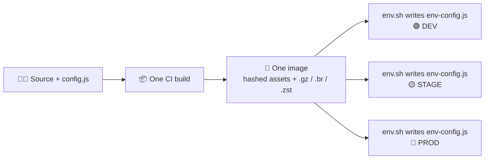

# 🧪 NXSamples

> **Build once. Ship everywhere. Serve bytes, not megabytes.**

Six independent [Nx](https://nx.dev) workspaces, six bundler setups, one obsession:
**a production frontend artifact that is built exactly once, compressed to the bone, and
re-configured at container start time without a rebuild.**

Every sample answers the same three questions with a different toolchain:

1. 🧩 **How do I eject the bundler config** (`webpack.config.js`, `rspack.config.js`, `vite.config.ts`, esbuild plugin options)
   so I fully control the output?
2. 🌍 **How do I keep runtime configuration out of the bundle** so one image can run in dev, test, stage and prod?
3. 🗜️ **How do I emit pre-compressed assets** (Brotli, gzip, Zstandard, AVIF, WebP) that
   [`nginx-brotli`](https://github.com/AdaskoTheBeAsT/nginx-brotli) can serve straight from disk?

---

## 🗺️ The sample matrix

| Sample                             | Framework  | Bundler                             | Ejected config                                                                                                 | Runtime config source                                          | Compression strategy                                                                                                           |
| ---------------------------------- | ---------- | ----------------------------------- | -------------------------------------------------------------------------------------------------------------- | -------------------------------------------------------------- | ------------------------------------------------------------------------------------------------------------------------------ |
| [`AngularEsBuild`](AngularEsBuild) | Angular 22 | esbuild (`@nx/angular:application`) | inline esbuild `plugins` + [`tools/ui-compression.config.cjs`](AngularEsBuild/tools/ui-compression.config.cjs) | `src/config.js` injected as `env-config` script                | 🏆 [`@adaskothebeast/esbuild-compressor`](https://github.com/AdaskoTheBeAsT/esbuild-compressor) 2.1 (gzip 9, Brotli 11, **Zstd 19**, AVIF, WebP) |
| [`AngularWebpack`](AngularWebpack) | Angular 22 | webpack 5 (`customWebpackConfig`)   | [`apps/ui/webpack.config.js`](AngularWebpack/apps/ui/webpack.config.js)                                        | `src/config.js` injected as `env-config` script                | `compression-webpack-plugin` (gzip 9, Brotli 11, **Zstd 19**) + `sharp` (AVIF, WebP)                                           |
| [`ReactWebpack`](ReactWebpack)     | React 19   | webpack 5 (`NxAppWebpackPlugin`)    | [`apps/ui/webpack.config.js`](ReactWebpack/apps/ui/webpack.config.js)                                          | `src/config.js` via plugin `scripts` option                    | `compression-webpack-plugin` (gzip 9, Brotli 11, **Zstd 19**) + `sharp` (AVIF, WebP)                                           |
| [`ReactRsPack`](ReactRsPack)       | React 19   | Rspack 2                            | [`apps/ui/rspack.config.js`](ReactRsPack/apps/ui/rspack.config.js)                                             | `src/config.ts` as a **second entry point** named `env-config` | `compression-webpack-plugin` (gzip 9, Brotli 11, **Zstd 19**) + [`compress.js`](ReactRsPack/compress.js) sweep (AVIF, WebP)    |
| [`ReactVite`](ReactVite)           | React 19   | Vite 8 (rolldown)                   | [`apps/ui/vite.config.ts`](ReactVite/apps/ui/vite.config.ts)                                                   | `src/config.ts` isolated via `manualChunks`                    | `vite-plugin-compression2` (gzip 9, Brotli 11, **Zstd 19**) + [`compress.js`](ReactVite/compress.js) sweep (AVIF, WebP)        |
| [`VueVite`](VueVite)               | Vue 3.5    | Vite 8 (rolldown)                   | [`apps/ui/vite.config.ts`](VueVite/apps/ui/vite.config.ts)                                                     | `src/config.ts` isolated via `manualChunks`                    | `vite-plugin-compression2` (gzip 9, Brotli 11, **Zstd 19**) + [`compress.js`](VueVite/compress.js) sweep (AVIF, WebP)          |

Each folder is a **standalone Nx workspace** with its own `package.json`, `yarn.lock` and
Playwright e2e project. Clone the repo, `cd` into any sample, and it just runs. 🎯

Compression coverage, per sample:

| Sample         | `.gz` | `.br` | `.zst`                     | AVIF / WebP | External binary |
| -------------- | ----- | ----- | -------------------------- | ----------- | --------------- |
| AngularEsBuild | ✅     | ✅     | ✅ (level 19, `zstd: true`) | ✅           | none            |
| AngularWebpack | ✅     | ✅     | ✅ (level 19)               | ✅           | none            |
| ReactWebpack   | ✅     | ✅     | ✅ (level 19)               | ✅           | none            |
| ReactRsPack    | ✅     | ✅     | ✅ (level 19)               | ✅           | none            |
| ReactVite      | ✅     | ✅     | ✅ (level 19)               | ✅           | none            |
| VueVite        | ✅     | ✅     | ✅ (level 19)               | ✅           | none            |

Every sample compresses with Node's built-in `zlib`, so gzip, Brotli and Zstd all work with a plain
`yarn install`. Zstd needs **Node.js 22.15+ / 24+**; on older runtimes the samples warn and skip
`.zst` instead of failing. 🙌

---

## 🌍 Build once, configure at startup

Baking `API_BASE_URL` into a bundle means one image per environment. That is a build matrix
nobody wants. Instead, every sample keeps configuration in a **separate, tiny, un-hashed-by-contract
bundle** called `env-config`:

```js
// apps/ui/src/config.js  (or config.ts)
window._env_ = {
  API_BASE_URL: 'https://localhost:5001',
  APP_TENANT_ID: 'your-tenant-id',
  APP_CLIENT_ID: 'your-client-id',
  API_SCOPES: 'api://your-client-id/.default',
};
```

Typed on the app side so consumers get IntelliSense instead of `any`:

```ts
// apps/ui/src/types/window.d.ts
export {};

declare global {
  interface Window {
    _env_: {
      clientId: string;
      tenantId: string;
      scopes: string[];
    };
  }
}
```

At container start, `env.sh` inside the
[`nginx-brotli`](https://github.com/AdaskoTheBeAsT/nginx-brotli) image finds
`env-config*.js` (hashed or not), rewrites it from real environment variables, and nginx serves
it with `Cache-Control: no-store`. The rest of the app stays byte-identical and fully cacheable.



---

## 🔧 How each bundler was tamed

### Angular + esbuild ⚡ (`AngularEsBuild`)

Angular's `scripts` option keeps `config.js` out of the module graph and emits a
standalone, auto-injected `env-config` bundle. Compression is delegated to my own plugin:

```jsonc
// apps/ui/project.json
"build": {
  "executor": "@nx/angular:application",
  "options": {
    "plugins": [
      {
        "path": "@adaskothebeast/esbuild-compressor",
        "options": {
          "extensions": [".js"],
          "skipFilesPattern": "env-config.*\\.js$",
          "gzipOptions": { "level": 9 },
          "brotliOptions": { "params": { "BROTLI_PARAM_QUALITY": 11 } },
          "zstd": true,
          "zstdOptions": { "params": { "ZSTD_c_compressionLevel": 19 } }
        }
      }
    ],
    "scripts": [
      { "input": "apps/ui/src/config.js", "bundleName": "env-config", "inject": true }
    ]
  }
}
```

Because Angular writes JS, global CSS and `index.html` in different stages, the esbuild plugin
alone only sees the JS stage. A `compress` target runs the package's **directory CLI** afterwards
so every final artifact (including images) is covered:

```jsonc
"compress": {
  "executor": "nx:run-commands",
  "dependsOn": ["build"],
  "options": { "command": "esbuild-compressor --config tools/ui-compression.config.cjs" }
}
```

```js
// tools/ui-compression.config.cjs
module.exports = {
  directory: 'dist/apps/ui/browser',
  extensions: ['.js', '.css', '.html', '.json', '.svg'],
  // main*.js is already handled by the esbuild plugin above, so skip it here.
  skipFilesPattern: '^(?:env-config|main)(?:-[^.]+)?\\.js$',
  gzip: true,
  gzipOptions: { level: 9 },
  brotli: true,
  brotliOptions: { params: { BROTLI_PARAM_QUALITY: 11 } },
  zstd: true,
  zstdOptions: { params: { ZSTD_c_compressionLevel: 19 } },
  imageExtensions: ['.png', '.jpg', '.jpeg'],
  imageFormats: { avif: { quality: 50 }, webp: { quality: 75 } },
};
```

`yarn build` here is literally `nx compress ui`, so "build" always means "build **and** compress". ✅
The output is `main-*.js{,.gz,.br,.zst}`, `styles-*.css{,.gz,.br,.zst}`, `index.html{,.gz,.br,.zst}`
and an untouched `env-config-*.js`.

### Angular / React + webpack 🧱 (`AngularWebpack`, `ReactWebpack`)

Full `webpack.config.js` ejection, then a stack of `compression-webpack-plugin` instances:

- gzip, level 9
- Brotli, quality 11
- **Zstandard, level 19** through a custom `algorithm` backed by Node's `zlib.zstdCompress`
- AVIF (q50) and WebP (q75) siblings for `.png/.jpg/.jpeg` through `sharp`

The Zstd plugin is only added when the runtime supports it, so older Node versions still build:

```js
const zstdPlugins =
  typeof zlib.zstdCompress === 'function'
    ? [
        new CompressionPlugin({
          filename: '[path][base].zst',
          algorithm(input, options, callback) {
            zlib.zstdCompress(
              input,
              { params: { [zlib.constants.ZSTD_c_compressionLevel]: options.level ?? 19 } },
              callback,
            );
          },
          exclude: skipRuntimeConfig,
          deleteOriginalAssets: false,
          test: /\.(js|css|html|svg|ttf)$/,
          threshold: 1024,
          minRatio: 0.8,
          compressionOptions: { level: 19 },
        }),
      ]
    : [];
```

Original assets are always kept (`deleteOriginalAssets: false`) so `brotli_static` / `gzip_static`
can fall back gracefully for clients without the right `Accept-Encoding`.

### React + Rspack 🦀 (`ReactRsPack`)

Rspack is webpack-API compatible, so `compression-webpack-plugin` works out of the box. The
interesting part is how `config.ts` becomes its own artifact: a **second entry point**.

```js
config.entry = {
  'env-config': path.resolve(__dirname, 'src/config.ts'),
  main: path.resolve(__dirname, 'src/main.tsx'),
};
```

Zstandard here needs no external binary, because Node's `zlib` gained native Zstd support:

```js
new CompressionPlugin({
  filename: '[path][base].zst',
  algorithm(input, options, callback) {
    zlib.zstdCompress(
      input,
      { params: { [zlib.constants.ZSTD_c_compressionLevel]: options.level ?? 19 } },
      callback,
    );
  },
  exclude: /env-config(.*)\.js$/,
  threshold: 1024,
  compressionOptions: { level: 19 },
});
```

### React / Vue + Vite 🌱 (`ReactVite`, `VueVite`)

Vite has no `scripts` option, so the split is done with `manualChunks` plus an explicit
`<script>` tag in `index.html`:

```ts
const manualChunks: ManualChunks = (id) => {
  if (id.includes('node_modules')) return 'vendor';
  if (id.includes('config.ts')) return 'env-config';
};

plugins: [
  compression({
    threshold: 1025,
    exclude: [/env-config.*\.js$/],
    algorithms: [
      defineAlgorithm('gzip', { level: 9 }),
      defineAlgorithm('brotliCompress', {
        params: { [zlib.constants.BROTLI_PARAM_QUALITY]: 11 },
      }),
      defineAlgorithm('zstd', {
        params: { [zlib.constants.ZSTD_c_compressionLevel]: 19 },
      }),
    ],
  }),
];
```

```html
<script type="module" src="/src/config.ts"></script>
<script type="module" src="/src/main.tsx"></script>
```

### 🧹 The post-build sweep (`compress.js`)

`ReactRsPack`, `ReactVite` and `VueVite` share the same
[`compress.js`](ReactVite/compress.js), wired as `nx run ui:compress` with `dependsOn: ["build"]`
(so `yarn build` runs it too). It walks `dist/apps/ui` and **fills in whatever the bundler plugin
did not produce**:

- `.gz`, `.br` and `.zst` for `js/mjs/css/html/json/svg` below the plugin's threshold
- AVIF (q50) and WebP (q75) siblings for `png/jpg/jpeg`
- skips anything matching `env-config(.*)\.js$`
- skips targets that already exist, so nothing is compressed twice
- degrades gracefully when the runtime has no Zstd support

---

## 🏆 `@adaskothebeast/esbuild-compressor`

Source: [github.com/AdaskoTheBeAsT/esbuild-compressor](https://github.com/AdaskoTheBeAsT/esbuild-compressor) ·
npm: `@adaskothebeast/esbuild-compressor`

Written because Angular's esbuild pipeline had no clean compression hook. It ships **two modes**:

| Mode             | Use it when                                       | What it does                                                                                        |
| ---------------- | ------------------------------------------------- | --------------------------------------------------------------------------------------------------- |
| 🔌 esbuild plugin | everything you care about passes through esbuild  | adds `.gz`, `.br` and optional `.zst` variants to in-memory output files                            |
| 🖥️ post-build CLI | Angular `application` builder, multi-stage output | scans the finished directory, compresses JS/CSS/HTML/JSON/SVG and generates AVIF/WebP from PNG/JPEG |

Every algorithm is a separate switch (v2.1.0+):

| Option   | Default | Effect                                                             |
| -------- | ------- | ------------------------------------------------------------------ |
| `gzip`   | `true`  | emit `.gz`, tuned through `gzipOptions`                            |
| `brotli` | `true`  | emit `.br`, tuned through `brotliOptions.params`                   |
| `zstd`   | `false` | emit `.zst`, tuned through `zstdOptions.params` (`ZSTD_c_*` names) |

```js
// tools/ui-compression.config.cjs
module.exports = {
  directory: 'dist/apps/ui/browser',
  gzip: false, // CDN already handles gzip
  brotliOptions: { params: { BROTLI_PARAM_QUALITY: 11 } },
  zstd: true,
  zstdOptions: { params: { ZSTD_c_compressionLevel: 22 } },
};
```

Zstandard uses `zlib.zstdCompress`, so no `zstd` binary is needed; on runtimes without it the
compressor warns once and skips `.zst` instead of failing the build.

Other options that matter: `extensions`, `imageExtensions`, `imageFormats` and the all-important
`skipFilesPattern`. 👇

---

## 🚫 Why `env-config` must **not** be pre-compressed

This is the sharpest edge of the whole setup, and every sample handles it explicitly:

- 🧊 `env-config*.js` is **rewritten at container startup**. A stale `.br`/`.gz`/`.zst` sibling from
  build time would still be served by `brotli_static` / `gzip_static`, silently shipping the wrong
  config.
- ✂️ Hence `skipFilesPattern: "env-config.*\\.js$"` in the esbuild plugin and the CLI config,
  `exclude: /env-config(.*)\.js$/` in the webpack, Rspack and Vite plugins, and the same guard in
  `compress.js`.
- 🔍 `env.sh` matches `env-config.js`, `env-config-DgyoikIV.js` and `env-config.something.js`, so
  output hashing stays enabled for cache busting.
- 🙅 nginx adds `Cache-Control: no-store, no-cache, must-revalidate, proxy-revalidate, max-age=0`
  for `env-config(.*)\.js$` only. Everything else keeps long-lived caching.

---

## 🐳 Serving it: `nginx-brotli`

The companion image [`AdaskoTheBeAsT/nginx-brotli`](https://github.com/AdaskoTheBeAsT/nginx-brotli)
is `nginx:alpine-slim` plus `ngx_brotli` and `headers-more`:

```nginx
brotli on;
brotli_comp_level 11;
brotli_static on;      # serve the .br file we built, zero CPU at request time

gzip on;
gzip_static on;        # serve the .gz file we built
gzip_vary on;
gzip_comp_level 9;
```

Multi-stage Dockerfile, condensed:

```dockerfile
################# Build #################
FROM adaskothebeast/node-build:v1.4.3 AS build
WORKDIR /app
COPY package.json yarn.lock ./
RUN yarn install --frozen-lockfile
COPY . .
RUN yarn build && yarn test && yarn lint

################# Final #################
FROM adaskothebeast/nginx-brotli:v2.0.17-slim AS deploy
WORKDIR /var/www
COPY --from=build /app/dist/apps/ui .
COPY ./.env .
RUN adduser -D -g 'www' www
EXPOSE 8080
ENTRYPOINT ["sh", "-c", "export API_BASE_URL \
  && export APP_TENANT_ID \
  && export APP_CLIENT_ID \
  && export API_SCOPES \
  && /usr/local/bin/env.sh API APP \
  && nginx -g 'daemon off;'"]
USER www
```

`env.sh API APP` means: take every env var starting with `API` or `APP`, write them into
`window._env_`, and (bonus) hot-patch `Content-Security-Policy` in `headers.conf` from
`CONTENT_SECURITY_POLICY`. 🔐 The container runs rootless as `www`.

### ⚠️ Zstandard and nginx: the missing piece

`.zst` artifacts are produced here because they are measurably smaller than Brotli on large
JavaScript bundles, but be aware of the deployment reality:

- 🚫 **There is no `zstd_static` in nginx.** Neither mainline nginx nor the `ngx_brotli` stack ships
  a module that serves pre-compressed `.zst` files the way `gzip_static` and `brotli_static` do,
  so the `nginx-brotli` image cannot pick them automatically.
- 🌐 `Content-Encoding: zstd` **is** supported by current Chromium and Firefox, so the bytes are
  useful once a server hands them out.
- 🛠️ Options today: serve them manually in nginx (a `map` on `$http_accept_encoding` plus
  `try_files` and an explicit `Content-Encoding: zstd` header, remembering `Vary: Accept-Encoding`),
  put a server with native support in front (Caddy, Envoy, some CDNs), or simply skip `.zst`.
- ✅ **Keep gzip and Brotli as the portable baseline.** Treat `.zst` as a bonus artifact, which is
  exactly why it is opt-in in `@adaskothebeast/esbuild-compressor`.

---

## 🧊 Zstandard prerequisites

**No sample needs the `zstd` CLI anymore.** All six use Node's built-in `zlib.zstdCompress`
(**Node.js 22.15+ / 24+**), and each one degrades to gzip + Brotli on older runtimes instead of
failing the build. That is the only prerequisite:

```bash
node --version   # must be >= 22.15 (or >= 24) for .zst output
```

The `zstd` CLI is still handy for **inspecting or verifying** artifacts locally
(`zstd -d main.js.zst -c | head`), and it is required if you fall back to a shell-based pipeline.
Earlier revisions of the webpack samples shelled out to it and guarded the build with a
`check-zstd.js` script, which is worth keeping around for that case:

```js
// check-zstd.js
const { exec } = require('child_process');
const os = require('os');

exec('zstd --version', (error) => {
  if (!error) {
    console.log('Zstd CLI is installed.');
    return;
  }

  console.error('Zstd CLI is not installed. Please install it before proceeding:');
  if (os.platform() === 'darwin') {
    console.error('For macOS: brew install zstd');
  } else if (os.platform() === 'linux') {
    console.error('For Linux: sudo apt-get install zstd');
  } else if (os.platform() === 'win32') {
    console.error(
      'For Windows: choco install zstandard or download from https://github.com/facebook/zstd/releases',
    );
  }
  process.exit(1);
});
```

Install the CLI per platform:

| OS                            | Command                                                                                                                                                                 |
| ----------------------------- | ----------------------------------------------------------------------------------------------------------------------------------------------------------------------- |
| 🪟 Windows                     | `choco install zstandard` or `winget install Facebook.Zstandard`, or grab a binary from [zstd releases](https://github.com/facebook/zstd/releases) and put it on `PATH` |
| 🐧 Linux (Debian/Ubuntu)       | `sudo apt-get install zstd`                                                                                                                                             |
| 🐧 Linux (Fedora/RHEL)         | `sudo dnf install zstd`                                                                                                                                                 |
| 🐧 Alpine (Docker build image) | `apk add --no-cache zstd`                                                                                                                                               |
| 🍎 macOS                       | `brew install zstd`                                                                                                                                                     |

Verify with:

```bash
zstd --version
```

Docker note: the `node-build` image only needs `apk add --no-cache zstd` if you actually rely on the
CLI. For these samples, plain Node is enough. 🙌

---

## 🚀 Getting started

Node.js 22.15+ or 24+ (for [native Zstd](#-zstandard-prerequisites)) and Yarn 4, pinned per
workspace via `packageManager`. No other tooling required.

Pick a sample:

```bash
cd AngularEsBuild     # or AngularWebpack | ReactWebpack | ReactRsPack | ReactVite | VueVite
yarn install
yarn build            # builds and produces .gz / .br / .zst plus AVIF/WebP
yarn test
yarn lint
```

Useful Nx targets:

```bash
nx serve ui                # dev server
nx run ui:compress         # post-build compression sweep (where defined)
nx e2e ui-e2e              # Playwright
nx show project ui --web   # inspect every target of the app
```

Workspaces were scaffolded with `npx create-nx-workspace@latest --package-manager=yarn`
and then moved to Yarn 4 (`yarn set version stable`).

---

## 🗂️ Layout

```text
NXSamples/
├── AngularEsBuild/      # Angular 22 + esbuild + @adaskothebeast/esbuild-compressor
├── AngularWebpack/      # Angular 22 + webpack 5 (gzip/brotli/zstd/avif/webp)
├── ReactRsPack/         # React 19 + Rspack (env-config as second entry, native zstd)
├── ReactVite/           # React 19 + Vite 8 (manualChunks + compression2 + zstd)
├── ReactWebpack/        # React 19 + webpack 5 (NxAppWebpackPlugin ejected)
└── VueVite/             # Vue 3.5 + Vite 8 (manualChunks + compression2 + zstd)
```

Every workspace follows the same shape:

```text
<Sample>/
├── apps/
│   ├── ui/
│   │   ├── src/
│   │   │   ├── config.js|ts        # 🌍 runtime configuration seed -> env-config bundle
│   │   │   ├── types/window.d.ts   # 🧠 typed window._env_
│   │   │   └── main.ts|tsx
│   │   ├── project.json            # 🎛️ build / compress / serve targets
│   │   └── <bundler>.config.*      # 🔧 the ejected config
│   └── ui-e2e/                     # 🎭 Playwright
└── compress.js | tools/*.cjs       # 🗜️ post-build compression (bundler dependent)
```

---

## 💡 Takeaways

- 🧱 **Eject the config.** Every real deployment need (custom compression, extra entry points,
  chunk naming) eventually requires it. All six samples prove it stays maintainable.
- 🌍 **`window._env_` beats build-time env vars.** One artifact, N environments, zero rebuilds.
- 🗜️ **Compress at build time, not at request time.** `brotli_static` at quality 11 costs nothing
  per request and typically cuts transfer by an order of magnitude.
- 🧊 **Never pre-compress the file you intend to rewrite.** Skip patterns are not optional.
- 🖼️ **Ship modern image formats** (AVIF, WebP) as siblings, not replacements.
- ⚠️ **Check the serving side before adding an encoding.** `.zst` is smaller than Brotli, but nginx
  has no `zstd_static`, so gzip and Brotli remain the baseline.

## 🔗 Related repositories

- 🐳 [nginx-brotli](https://github.com/AdaskoTheBeAsT/nginx-brotli) - nginx with Brotli + headers-more, `env.sh` runtime config injection, rootless, secure headers
- 🗜️ [esbuild-compressor](https://github.com/AdaskoTheBeAsT/esbuild-compressor) - `@adaskothebeast/esbuild-compressor`, esbuild plugin + post-build directory CLI

## 📄 License

MIT. See [LICENSE](LICENSE).
